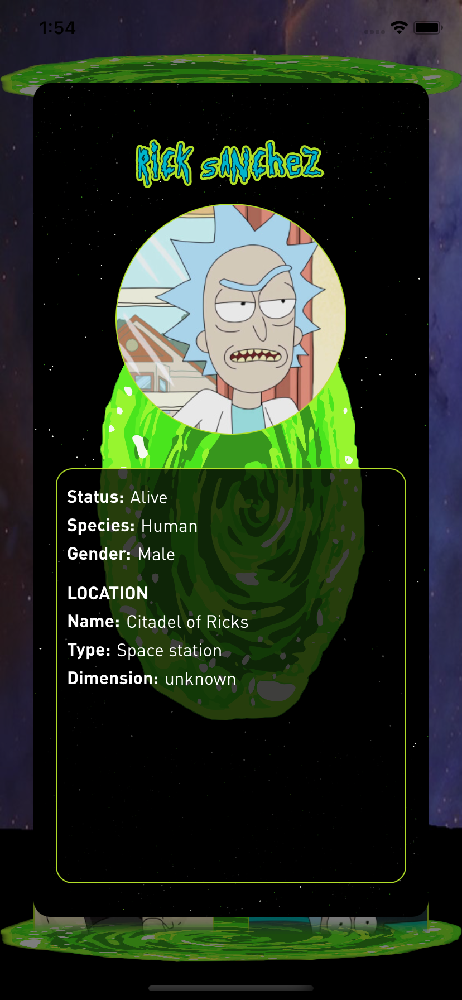

# VIPER-Demo

VIPER-Demo for iPhone is a project that shows a list of Rick & Morty's characters, developed in order to test my knowledge in VIPER pattern.

### API 

The app obtains the characters array from https://rickandmortyapi.com/ developed by Axel Fuhrmann.

### Screenshots

 

### About

Developed by Martin Regas (ARG) - August 2022.
